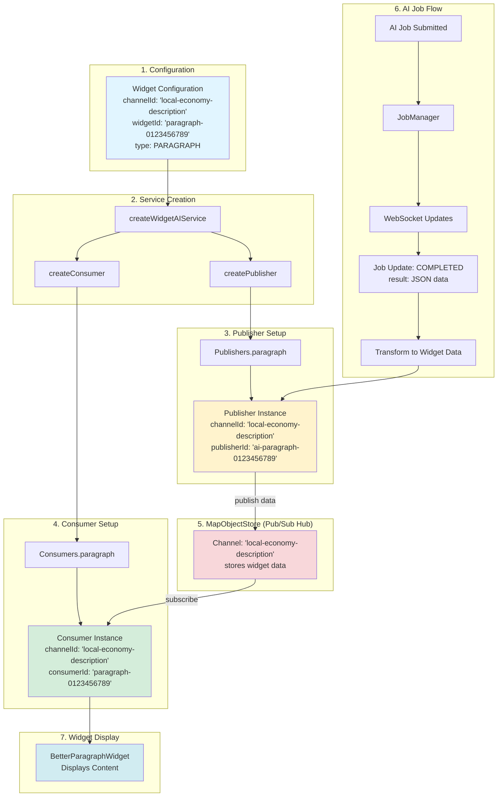
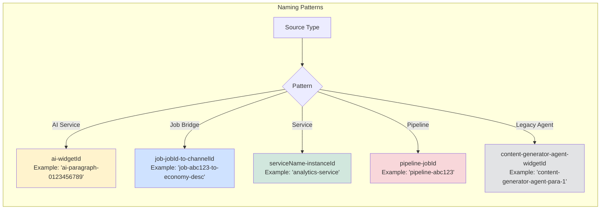
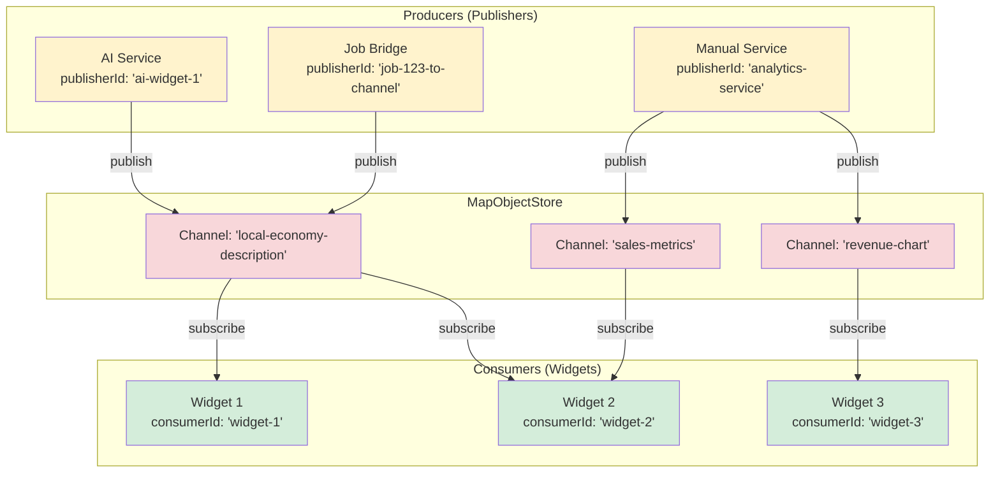
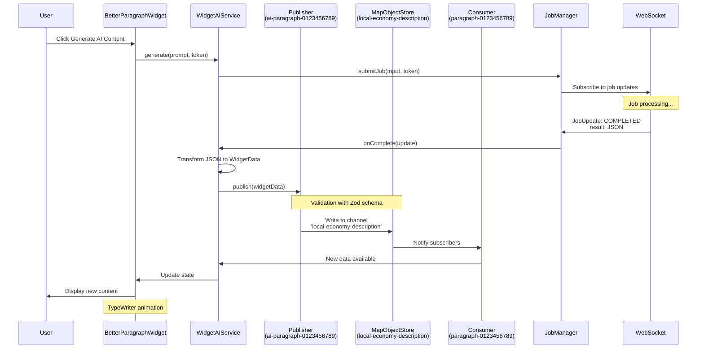
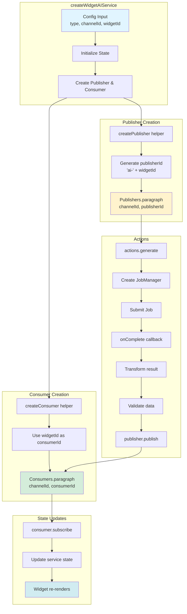
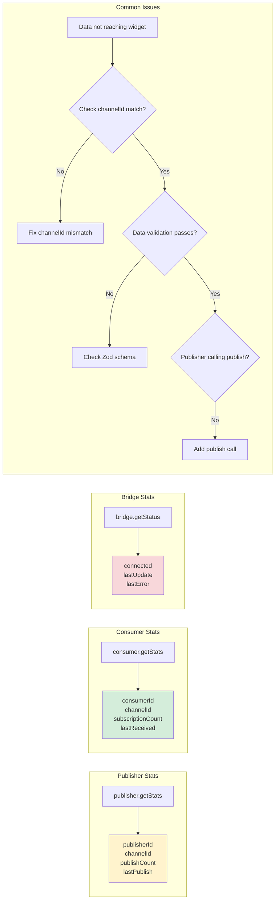

# Job Publisher Naming System

## Overview

This document explains how jobs and AI services choose names when publishing data to widgets through the Widget Bridge system. Understanding this naming convention is crucial for debugging data flow and ensuring proper communication between data producers and consumers.

## Architecture

The Widget Bridge system uses a **channel-based pub/sub architecture** where:
- **Channels** are named communication pipes (identified by `channelId`)
- **Publishers** write data to channels (identified by `publisherId`)
- **Consumers** read data from channels (identified by `consumerId`)
- Multiple publishers can write to the same channel
- Multiple consumers can read from the same channel

## The Naming Convention

### Channel ID (`channelId`)

The **channel ID** determines **which data pipe** is used for communication. It acts as a topic or category.

```typescript
// Examples of channel IDs
'paragraph-content'     // For paragraph widget content
'sales-metrics'         // For sales metric data
'revenue-chart'         // For revenue chart data
'property-summary'      // For property summary content
```

**Best Practices:**
- Use descriptive, kebab-case names
- Indicate the widget type or data purpose
- Keep it unique within your dashboard
- Avoid generic names like "data" or "widget"

### Publisher ID (`publisherId`)

The **publisher ID** identifies **who is writing** data to a channel. This is important for:
- Debugging: tracking which service sent data
- Logging: identifying the source of updates
- Multi-source scenarios: multiple publishers on one channel

#### AI Service Publisher Pattern

When the Widget AI Service creates a publisher, it uses this pattern:

```typescript
`ai-${widgetId}`
```

**Example:**
```typescript
// Widget ID: 'paragraph-widget-1'
// Publisher ID: 'ai-paragraph-widget-1'

const publisher = Publishers.paragraph(
  'paragraph-content',           // channelId
  'ai-paragraph-widget-1'        // publisherId = ai-${widgetId}
);
```

**Why the `ai-` prefix?**
- Clearly identifies AI-generated content
- Distinguishes from user-edited or manually set content
- Enables filtering/tracking of AI updates in logs

#### Consumer ID Pattern

Consumers (widgets reading data) use the plain `widgetId` without prefix:

```typescript
const consumer = Consumers.paragraph(
  'paragraph-content',           // channelId
  'paragraph-widget-1'           // consumerId = widgetId (no prefix)
);
```

## Code Examples

### Example 1: Widget AI Service

From `widget-ai-service.ts`:

```typescript
function createPublisher<T extends WidgetType>(
  type: T,
  channelId: string,
  widgetId: string
): WidgetPublisher<WidgetDataTypeMap[T]> {
  const publishers = {
    [WIDGET_TYPES.PARAGRAPH]: Publishers.paragraph,
    [WIDGET_TYPES.TABLE]: Publishers.table,
    [WIDGET_TYPES.METRIC]: Publishers.metric,
    // ... other types
  };
  
  // Publisher ID uses 'ai-' prefix
  return publishers[type](channelId, `ai-${widgetId}`);
}

function createConsumer<T extends WidgetType>(
  type: T,
  channelId: string,
  widgetId: string
): WidgetConsumer<WidgetDataTypeMap[T]> {
  const consumers = {
    [WIDGET_TYPES.PARAGRAPH]: Consumers.paragraph,
    [WIDGET_TYPES.TABLE]: Consumers.table,
    [WIDGET_TYPES.METRIC]: Consumers.metric,
    // ... other types
  };
  
  // Consumer ID uses plain widgetId
  return consumers[type](channelId, widgetId);
}
```

### Example 2: Manual Publisher Creation

For custom data sources (not AI):

```typescript
// A manual data service
const publisher = Publishers.metric(
  'cpu-usage',           // channelId: what data this represents
  'system-monitor'       // publisherId: who is publishing
);

// Publish data
publisher.publish({
  label: 'CPU Usage',
  value: 75.2,
  unit: '%'
});
```

### Example 3: Job-Widget Bridge

When creating bridges from jobs to widgets:

```typescript
const bridgeId = `job-${jobId}-to-${channelId}`;

const publisher = createWidgetPublisher(
  WidgetChannels.paragraph('property-analysis'),  // channelId
  bridgeId                                        // publisherId
);

// Result: publisherId = 'job-123-to-property-analysis'
```

## Complete Data Flow Example

Here's how data flows from an AI job to a widget:

```typescript
// 1. Widget Configuration
const config = {
  channelId: 'local-economy-description',
  widgetId: 'paragraph-0123456789',
  type: WIDGET_TYPES.PARAGRAPH
};

// 2. Publisher Created (in widget-ai-service)
const publisher = Publishers.paragraph(
  'local-economy-description',        // channelId
  'agent-local-economy'               // publisherId = ai-${widgetId}
);

// 3. Consumer Created (in widget-ai-service)
const consumer = Consumers.paragraph(
  'paragraph-content',        // channelId (same as publisher)
  'paragraph-widget'          // consumerId = widgetId
);

// 4. AI generates content and publishes
publisher.publish({
  content: 'The economy around this property...',
  markdown: false
});

// 5. Widget receives update via consumer
consumer.subscribe((data) => {
  // Widget updates with new content
  console.log('Received:', data.content);
});
```

**Console logs would show:**
```
[Publisher ai-paragraph-widget] Published to channel paragraph-content
[Consumer paragraph-widget] Received data from paragraph-content
```

## Naming Patterns in the Codebase

### Pattern 1: AI-Generated Content
```typescript
publisherId: `ai-${widgetId}`
consumerId: widgetId
```

### Pattern 2: Job Bridges
```typescript
publisherId: `job-${jobId}-to-${channelId}`
```

### Pattern 3: Service Publishers
```typescript
publisherId: `${serviceName}-${instanceId}`
// Examples:
'analytics-service'
'data-service'
'realtime-service'
```

### Pattern 4: Pipeline Publishers
```typescript
publisherId: `pipeline-${jobId}`
consumerId: `pipeline-consumer-${jobId}`
```

### Pattern 5: Content Generator Agents (Legacy)
```typescript
publisherId: `content-generator-agent-${widgetId}`
```

## Debugging Tips

### Finding Who Published Data

When debugging data flow issues:

```typescript
// Check publisher stats
const stats = publisher.getStats();
console.log('Publisher ID:', stats.publisherId);
console.log('Channel ID:', stats.channelId);
console.log('Publish count:', stats.publishCount);
console.log('Last publish:', stats.lastPublish);
```

### Tracking Data Flow

Add logging to see the complete flow:

```typescript
// In publisher
publisher.publish(data);
// Logs: [Publisher ai-paragraph-widget] Published to channel paragraph-content

// In consumer  
consumer.subscribe((data) => {
  console.log(`[Consumer ${consumerId}] Received data`);
});
```

### Common Issues

**Issue 1: Data not reaching widget**
- ✅ Check: channelId matches between publisher and consumer
- ✅ Check: Data passes validation (check console for validation errors)

**Issue 2: Multiple publishers conflict**
- ✅ Check: Publisher IDs are unique
- ✅ Check: Last-write-wins behavior is intended

**Issue 3: Stale data**
- ✅ Check: Publisher is actually calling `publish()`
- ✅ Check: Consumer subscription is active
- ✅ Check: Widget is properly mounted

## Configuration Reference

### Widget AI Service Config

```typescript
interface WidgetAIConfig {
  type: WidgetType;           // Widget type
  channelId: string;          // Channel to publish/consume on
  widgetId: string;           // Widget instance ID
  // ... other options
}

// Results in:
// - Publisher ID: `ai-${widgetId}`
// - Consumer ID: `${widgetId}`
// - Channel ID: `${channelId}`
```

### Custom Publisher Config

```typescript
// Direct creation
const publisher = Publishers.paragraph(
  channelId,    // Your choice - describes the data
  publisherId   // Your choice - identifies the source
);
```

## Best Practices

### ✅ DO

1. **Use descriptive channel IDs**
   ```typescript
   'property-economic-summary'  // Good
   'data'                       // Bad
   ```

2. **Use meaningful publisher IDs**
   ```typescript
   'ai-economic-widget'         // Good
   'publisher1'                 // Bad
   ```

3. **Include context in IDs**
   ```typescript
   `ai-${widgetType}-${widgetId}`
   ```

4. **Keep IDs consistent**
   - Same format across similar components
   - Predictable patterns for debugging

### ❌ DON'T

1. **Don't use generic names**
   ```typescript
   'widget', 'data', 'channel'  // Too generic
   ```

2. **Don't create publisher ID collisions**
   ```typescript
   // Bad: two publishers with same ID
   const pub1 = Publishers.paragraph('ch1', 'service');
   const pub2 = Publishers.paragraph('ch1', 'service');
   ```

3. **Don't hardcode IDs without context**
   ```typescript
   'abc123'  // What is this?
   ```

4. **Don't mix naming conventions**
   ```typescript
   // Bad: inconsistent patterns
   'ai-widget-1'
   'widget-2-ai'
   'aiWidget3'
   ```

## Related Files

- `widget-bridge.ts` - Core publisher/consumer implementation
- `widget-ai-service.ts` - AI service that uses the naming patterns
- `widget-system.ts` - Widget types and schemas
- `JobManager.ts` - Job submission and updates
- `BetterParagraphWidget.svelte` - Example widget implementation

## Summary

The naming system follows this hierarchy:

```
Channel ID (what)
  ├─ Publisher ID (who writes)
  │    └─ AI Service: `ai-${widgetId}`
  │    └─ Job Bridge: `job-${jobId}-to-${channelId}`
  │    └─ Custom: `${serviceName}-${instanceId}`
  │
  └─ Consumer ID (who reads)
       └─ Widget: `${widgetId}`
       └─ Custom: `${componentId}`
```

**Key Takeaway:** The channel ID determines *what data* flows, while publisher/consumer IDs identify *who* is participating in that data flow. This separation enables flexible architectures with multiple producers and consumers while maintaining clear debugging and logging.

## Workflow Diagrams

### Complete Data Flow Architecture



### Publisher ID Naming Patterns



### Channel-Based Pub/Sub Model



### Detailed AI Job to Widget Flow



### Widget AI Service Internal Flow



### Debugging Data Flow


 
